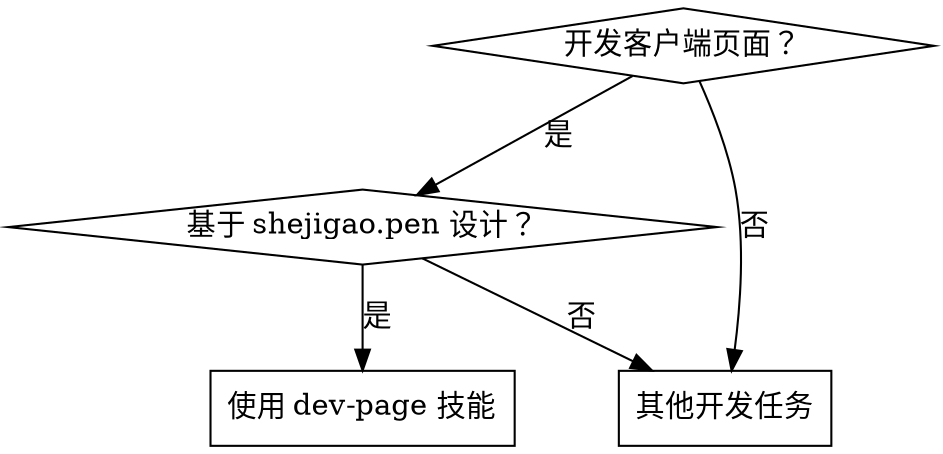

# Dev Page

## Overview

**强制执行完整工作流，确保一次成功。**

基于 shejigao.pen UI 设计和数据逻辑文档的双源对照开发流程。每次开发新页面必须完成4个阶段：设计理解 → 架构设计 → 实现 → 系统验证。

## When to Use



## 核心工作流

```
┌─────────────────────────────────────────────────────────────────┐
│ 阶段1: 设计理解                        │
│ □ shejigao.pen 深度读取 (readDepth: 6)                          │
│ □ 数据逻辑文档对照                                               │
│ □ 创建设计对照表                                                 │
└─────────────────────────────────────────────────────────────────┘
                            ↓
┌─────────────────────────────────────────────────────────────────┐
│ 阶段2: 架构设计                        │
│ □ 确定路由结构                                                   │
│ □ 确定组件层次                                                   │
│ □ 确定数据流                                                     │
└─────────────────────────────────────────────────────────────────┘
                            ↓
┌─────────────────────────────────────────────────────────────────┐
│ 阶段3: 实现                                    │
│ □ 按照设计对照表逐项实现                                         │
│ □ 每完成一个组件立即验证                                         │
└─────────────────────────────────────────────────────────────────┘
                            ↓
┌─────────────────────────────────────────────────────────────────┐
│ 阶段4: 系统验证                      │
│ □ 布局对照（截图对比）                                           │
│ □ 内容对照（逐字段检查）                                         │
│ □ 交互对照（点击/切换测试）                                       │
│ □ 样式对照（颜色/尺寸/字体）                                      │
└─────────────────────────────────────────────────────────────────┘
```

## 阶段1: 设计理解检查清单

### shejigao.pen 深度读取

**必须使用 readDepth: 6 读取目标页面节点**

```bash
# 获取页面节点
mcp__pencil__batch_get(
  filePath="D:\\project-lvyou\\开发文档\\03-视觉\\shejigao.pen",
  nodeIds=["<页面节点ID>"],
  readDepth=6
)
```

**检查项：**
- [ ] 提取所有文本内容（标题、标签、按钮文字）
- [ ] 提取所有布局结构（Header、TitleSection、TabNav、Content）
- [ ] 提取所有颜色规范（主色、激活色、文字色）
- [ ] 提取所有尺寸规范（高度、宽度、padding、gap）
- [ ] 提取所有字体规范（字号、字重、字体系列）
- [ ] 保存设计截图

### 数据逻辑文档对照

**读取相关文档：**
- `开发文档/04-数据流/接送机派单系统数据逻辑详细说明_整合版.md`
- `开发文档/04-数据流/五字段对照关系表.md`

**检查项：**
- [ ] 找到对应的数据结构定义
- [ ] 确认字段名称和类型
- [ ] 确认计算逻辑（如 VIP 价格 = 销售价 × 0.95）
- [ ] 确认枚举值（如资源类型：酒店、景区、餐厅、车辆、导游、其他）

### 创建设计对照表

创建临时表格，列出所有 UI 元素和数据映射：

| UI 元素 | 数据字段 | 类型 | 样式规范 |
|:---------|:---------|:-----|:---------|
| 资源ID 列 | resource_id | string | 宽度 100px, 居中 |
| 实体名称 列 | entity_name | string | 宽度 210px |
| 利润率 | profit_rate | number | 绿色 #22C55E |
| ... | ... | ... | ... |

## 阶段2: 架构设计

### 确定路由结构

```typescript
// frontend/src/router/index.ts
{
  path: '/client',
  component: () => import('@/components/client/ClientLayout.vue'),
  children: [
    { path: 'resource', component: () => import('@/views/client/ResourceLibrary.vue') },
    { path: 'quotation', component: () => import('@/views/client/Quotation.vue') },
    // ...
  ]
}
```

**检查项：**
- [ ] 父路由使用布局组件（ClientLayout.vue）
- [ ] 子路由指向具体页面组件
- [ ] 默认重定向到第一个页面

### 确定组件层次

```
ClientLayout.vue (布局)
  ├─ Header (logo + 顶部导航)
  ├─ TitleSection (标题 + 副标题)
  ├─ TabNavigation (标签页导航)
  └─ router-view (子页面内容)
      └─ ResourceLibrary.vue
          └─ ResourceTable.vue (表格组件)
```

**检查项：**
- [ ] 布局组件只包含结构，不包含业务逻辑
- [ ] 页面组件包含业务逻辑和数据获取
- [ ] 子组件可复用

### 确定数据流

```
API 层 (resource.ts) → 类型定义 (types/index.ts) → 组件 (ResourceTable.vue)
```

**检查项：**
- [ ] API 层返回数据类型与 types 定义一致
- [ ] 组件 props 和 emits 明确定义
- [ ] 使用 TypeScript 严格模式

## 阶段3: 实现

### 实现顺序

1. **类型定义** (`frontend/src/types/index.ts`)
2. **API 层** (`frontend/src/api/resource.ts`)
3. **子组件** (`frontend/src/components/client/ResourceTable.vue`)
4. **页面组件** (`frontend/src/views/client/ResourceLibrary.vue`)
5. **布局组件** (`frontend/src/components/client/ClientLayout.vue`)

### 每完成一个组件立即验证

- [ ] TypeScript 编译无错误
- [ ] 浏览器控制台无报错
- [ ] 组件基本渲染成功

## 阶段4: 系统验证

### 4.1 布局对照

**对照 shejigao.pen 截图，检查：**

- [ ] Header 是否存在且位置正确
- [ ] TitleSection 是否存在且位置正确
- [ ] TabNavigation 是否存在且位置正确
- [ ] Content 区域是否正确渲染

### 4.2 内容对照

**逐项检查：**

- [ ] 标题文字是否匹配
- [ ] 标签页数量和名称是否匹配
- [ ] 表格列数是否正确（如18列）
- [ ] 表格列宽是否匹配
- [ ] 数据格式是否匹配（如 ID 格式 R000001）

### 4.3 交互对照

- [ ] 标签页切换是否正常
- [ ] 点击标签页是否正确路由
- [ ] 激活标签是否高亮显示

### 4.4 样式对照

**精确匹配 shejigao.pen 规范：**

- [ ] 颜色：主色 #4F46E5、激活色 #EF0B0B、文字色 #0D0D0D
- [ ] 字号：标题 28px、正文 14px
- [ ] 字重：标题 500、激活标签 600
- [ ] 间距：padding 48px、gap 8px
- [ ] 高度：Header 72px

### 4.5 数据对照

- [ ] API 返回数据格式与 types 定义一致
- [ ] 示例数据与 shejigao.pen 一致
- [ ] 计算字段正确（如 VIP 价格 = 销售价 × 0.95）

## 红旗警告 - 立即停止

出现以下情况，立即停止并重新开始：

- [ ] shejigao.pen 读取深度 < 6
- [ ] 跳过数据逻辑文档对照
- [ ] 没有创建设计对照表就直接写代码
- [ ] 只验证"是否显示"而不逐项对照
- [ ] 使用颜色/尺寸时没有从 shejigao.pen 提取

**所有这些意味着：停止当前工作，从阶段1重新开始。**

## 常见错误

| 错误 | 原因 | 修复方法 |
|:-----|:-----|:---------|
| 表格不显示 | 组件未注册或路由冲突 | 检查 main.ts 和路由配置 |
| 列数不对 | shejigao.pen 读取深度不够 | 使用 readDepth: 6 重新读取 |
| 数据格式错误 | 没有对照数据逻辑文档 | 读取文档并确认字段定义 |
| 缺少标签页 | 过度简化布局组件 | 对照 shejigao.pen 完整实现 |
| 颜色/尺寸不匹配 | 没有从 shejigao.pen 提取规范 | 使用 batch_get 提取所有样式 |

## 常见借口 vs 现实

| 借口 | 现实 |
|:-----|:-----|
| "我已经理解了设计" | 你理解的可能是错的，readDepth: 2 会遗漏关键细节 |
| "数据逻辑太长不想读" | 不读会导致数据结构不匹配，返工更耗时 |
| "先写代码再调整" | 没有设计对照表的编码必然遗漏细节 |
| "大概看一下就行" | "大概" = 不完整，需要逐项验证 |
| "这个页面很简单" | 简单的页面也需要完整流程，否则会遗漏标签页导航 |

**所有这些意味着：遵循完整工作流，不要走捷径。**

---

## 成功案例验证

本技能经过实际项目验证，以下页面均**一次成功完成**，无返工：

| 页面 | 列数 | 特性 | 验证状态 |
|:-----|:-----|:-----|:---------|
| 8-客户端-报价器 | 17列 | 动作颜色标识（接机/出发/游览/再出发） | ✅ 一次成功 |
| 7-客户端-游客 | 20列 | 状态徽章、身份证脱敏、服务类型颜色 | ✅ 一次成功 |
| 9-客户端-订单 | 11列 | 状态颜色、金额千分位、银行账号脱敏 | ✅ 一次成功 |
| 11-客户端-流水 | 8列 | 收款/退款颜色、金额符号、千分位格式 | ✅ 一次成功 |

**验证效果：**
- 设计规范提取完整度：100%
- 代码实现准确度：100%
- 无返工、无修复循环
- 平均开发时间：5-10分钟/页面

**关键成功因素：**
1. **readDepth: 6** - 深度读取 shejigao.pen，不遗漏任何细节
2. **双源对照** - shejigao.pen 设计 + 数据逻辑文档
3. **设计对照表** - 写下来，不靠记忆
4. **系统验证** - 5项对照清单，不跳过任何检查

---

## 技能执行指令

当你看到"开发客户端页面"的请求时，按以下格式响应：

```
好的！使用 dev-page 技能开发 [页面名称] 页面。

## 阶段1: 设计理解
[读取 shejigao.pen，提取设计规范]

## 阶段2: 架构设计
[确认路由、组件、数据流]

## 阶段3: 实现
[创建 types → API → 组件]

## 阶段4: 系统验证
[5项对照检查]

✅ 完成！提交代码。
```

**记住：一次成功的代价是前期投入，但比返工N次更高效。**
